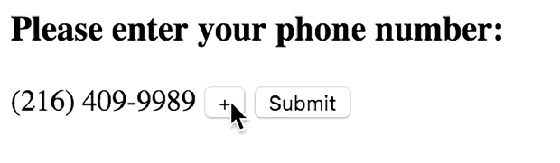
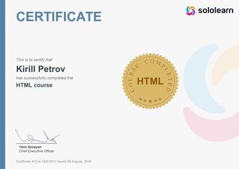
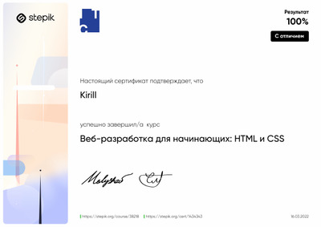
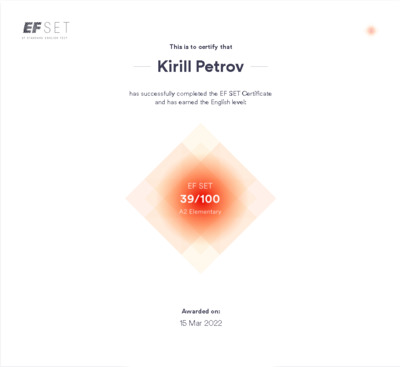

# Kirill Petrov
## Contact information

- Phone: ```+380 096 090 5928```
- E-mail: ```kkpetrov.dev@gmail.com```
- Telegram: [@kk_ppetrov](https://t.me/kk_ppetrov/)
- LinkedIn: [Kirill Petrov](https://www.linkedin.com/in/kirill-petrov-5a72b622b/)

## About
I'm 18 y.o. and I am a begginer web developer from Ukraine. Currently I am studying front-end technologies and that is why i'm here.

## Skills
- __HTML__
- __CSS (Bootstrap, BEM)__
- __Programming languages:__
  - __Python__
  - *JavaScript Basics*
  - *PHP Basics*
  - *C# Basics*
  - *C++ Basics* 
  - *SQL Basics*
- __Figma, Adobe XD, Adobe Photoshop__
- __Editors:__
  - __VS Code, Sublime Text__
  - *Visual Studio, PyCharm, WebStorm, Atom*

## Code example
```python
def factorial(n):
    result = 1
    if n == 0 or n == 1:
        return 1
    while n > 1:
        result *= n
        n -= 1
    return result
```

## Courses
- «HTML Fundamentals» on the [SoloLearn](sololearn.com) *(completed)*<br>

- «Веб-разработка для начинающих: HTML и CSS» on the [Stepik](stepik.org) *(completed)*<br>

- «Python Core» on the [SoloLearn](sololearn.com) *(in progress)*
- «Полное руководство по Python3» on the [Udemy](udemy.com) *(in progress)*

## Languages
- __Ukrainian *(Native language)*__
- __Russian *(Advanced)*__
- __English *(B1, Intermediate)*__<br>

- __Czech *(Basic knowledge)*__